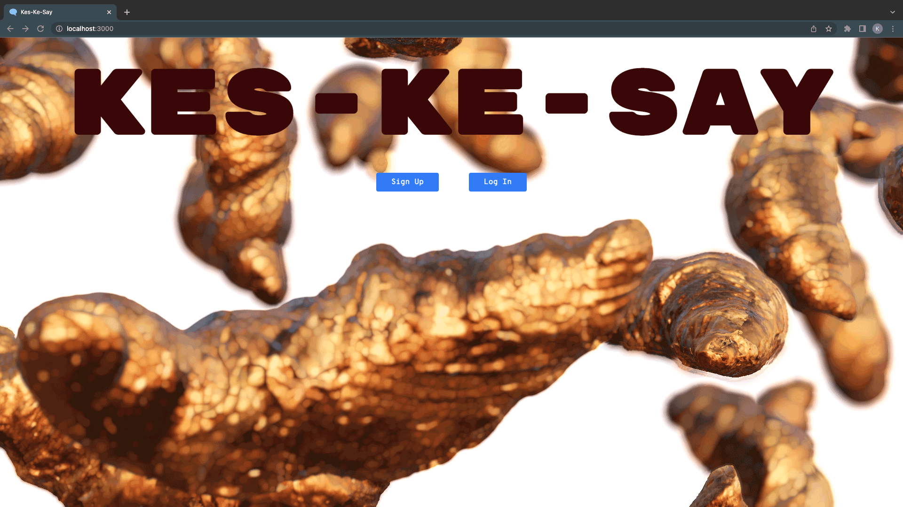
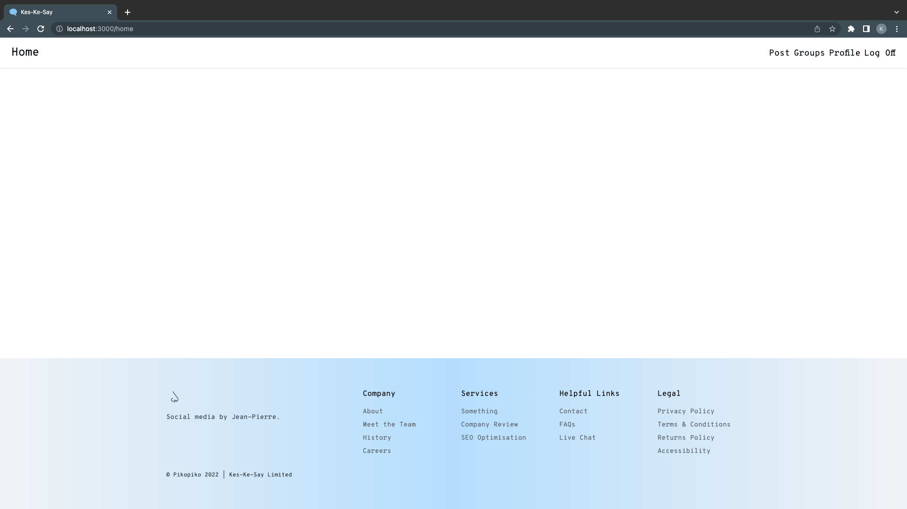
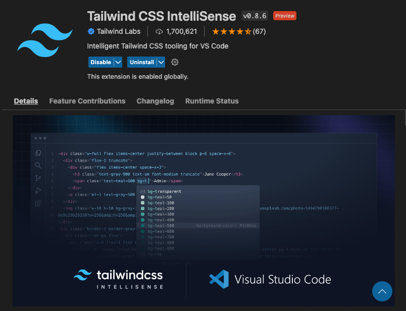
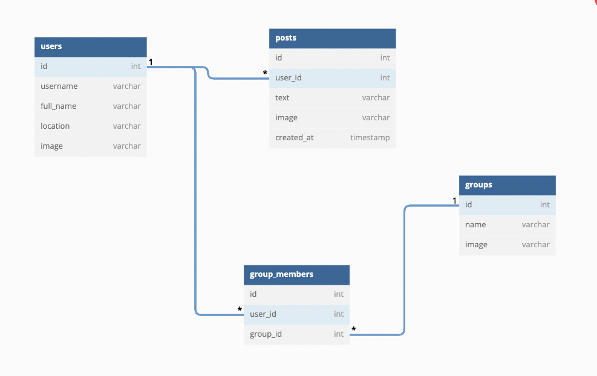
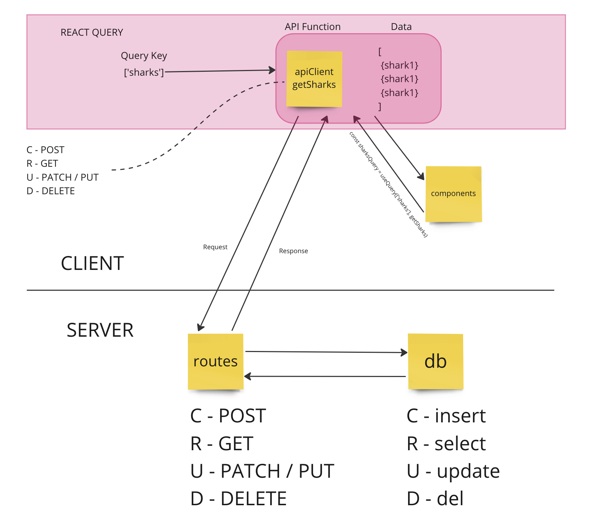
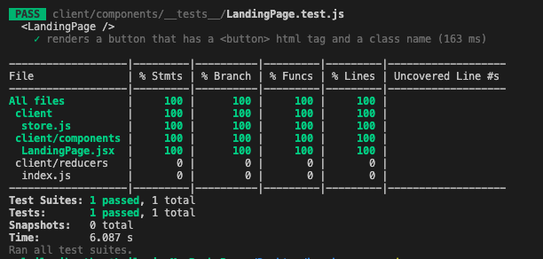

# Kes-Ke-Say
## Get to know your Repo
This repo is designed to provide space to code our fullstack app project titled _Kes-Ke-Say_. It contains node modules and folders for databases, routes, api requests, and react components. 

## From the Command Line
```
git clone
npm install
git checkout -b <branchname>
npm run knex migrate:latest
npm run knex seed:run
npm run dev
```
Visit [http://localhost:5173](http://localhost:5173) to view in the browser.

You can find the API server running on [http://localhost:3000](http://localhost:3000).

To kickstart the project, we have provided you with a landing page, a temporary user homepage plus knex migrations and seeds. Here is what you should see in your browser.




## Gotchas

A few notes to keep you out of trouble:
- When running knex, run `npm run knex <command>`, e.g. `npm run knex migrate:latest` rather than using `npx`
- This repo is set up for Tailwind CSS with CSS Modules. We would like you to use Tailwind inline styling for the most part. If your feature requires some additional non Tailwind CSS you can use a CSS module. The global styles live in `/client/styles/index.css` but for each component you create a css module that you can import and create component specific styling. See `LandingPage.jsx` and `LandingPage.module.css` for example setup. Please do not make changes to the global styles without consulting the team.
- Install the extension 'Tailwind CSS IntelliSense' for VS Code to help with styling inline.


___
## About Kes-Ke-Say

Kes-Ke-Say (***qu'est-ce que c'est***) is a social sharing platform by DEV Academy's own Jean Pierre.


The meaning of ***QU'EST-CE QUE C'EST?*** is what is it? : what's that?


It is a chic new social media outlet that is proudly ad and pop-up free, no marketplace or sneaky commerce - just socialising, the way it used to be! Times are tough so this new platform is for those who want to share - and perhaps even complain a little - with like minded individuals.

Jean Pierre is very proudly French and a fan of all things design. This project is heavily driven by Jean Pierres vision as he is an opinionated Product Owner.

## User Stories

__As a non registered/logged in user, Jean Pierre would like...__

To see a locked down landing page asking me to register, then sign in. I will learn nothing about the social media platform from the landing page as its exclusive. If you know, you know.

__As a registered/logged in user, Jean Pierre would like...__

To have access to a dashboard user homepage that shows:
- general navigation
- the weather in my location
- the local time in my location
- a link to view a national news feed
- the option to create a post
- the most recent posts made by all users
- the option to view individual posts

In a separate sections, users need to also have access to:
- the option to view and edit my own profile
- the option to select an avatar to personalise my profile
- the option to view all users

Similarly, users need to also have access to groups. Groups are for like minded individuals to come together and rally around a certain passion or dislike. Users need to have access to:
- the option to view and edit a group
- the option to join and view a group
- the option to view all possible groups to join

___
## Let's Build It

The above user stories will strongly guide this build but ultimately, the initial MVP for Kes-Ke-Say is to render some simple data for our app to build upon over future cohorts.

If you think you might need more than one database table, or have lots of details you want to store, how could you simplify the information you're keeping track of? Leave more complex data until later in the project.

Our first job is getting something showing on the front end from our database. Here's a list of steps in case they are useful. You can build in any order you like.

## Back End

1.  Database to store a list of your things (e.g. users, posts)

  


2.  Migrations and seed data examples

__Users table -__
  |id|username|full_name|location|image|
  |---|---|---|---|---|
  | 1 | 'paige' | 'Paige Turner' | 'Auckland' | 'ava_01.png'' |

 
__Posts table -__
  |id|user_id|body|image|created_at|
  |---|---|---|---|---|
 |1|1|'I found this really interesting book, you should check it out'|''|new Date(Date.now())|
 |2|1|'I found this really cool Italian place, they have the best food'|''|new Date(Date.now())|


1.  Build an API (back end route) to get the information from your database

  

2.  Test your API with [Insomnia](https://insomnia.rest/)

## Front End

1.  Build a React Component with static html
2.  Start with hardcoded data, for example:
```ts
interface UsersData {
  users: User[]
  isLoading: boolean
  error: string | null
}

const initialState: UsersData = {
  users: [
    {
      id: 1,
      auth0Id: 'auth0|123',
      username: 'paige',
      fullName: 'Paige Turner',
      location: 'Auckland',
      image: 'ava-03.png'
    },
    {
      id: 2,
      auth0Id: 'auth0|234',
      username: 'ida',
      fullName: 'Ida Dapizza',
      location: 'Auckland',
      image: 'ava-02.png'
    }
  ],
  isLoading: false,
  error: null,
}
```
3.  Build an API Client in the front end to request the information from your routes
4.  Use `useQuery` to fetch data with the API Client function
5.  Add a loading state to show when data is being fetched
6.  Show an error message if something goes wrong

## Next steps

At this stage we should be able to view our information. Below are suggested next steps, though you might prioritize these in another order.

- Include the ability to add a new record (will need a form in your components)
- Include the ability to remove/delete records
- Include the ability to update records (e.g. for correcting typos)
  - You might have some other information that should be included in the database, but this may require adjusting your database design - start simple!
- Is there any complex data you chose to not include earlier or any way you could expand this dataset?
- If you haven't already, CSS!

## Testing

<details>
<summary>Useful test scripts</summary>

```c
npm test // watches and runs tests when file is saved
npm test -- --coverage // shows coverage summary
```

</details>

Make sure anything you write code for is submitted for review with tests. Untested code will not be merged so don't forget to test as you go!

We're looking for test coverage in the green range (80% and over) for each part of a ticket you contribute to.

Simply run `npm test -- --coverage` to see your coverage stats. Uncovered lines will help guide the kinds of tests you need to write so take some time to checkout your coverage report.

Here is an example of what we would like to see with regards to testing coverage:

  

## Other Tips for Kes-Ke-Say
- Have fun ㋡
- Pace yourself
- Take breaks, touch some grass
- Dream big!